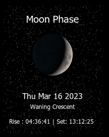

# MMM-Moon

Display a picture of the current moon phase along with moonrise and moonset times on your [MagicMirror²](https://github.com/MichMich/MagicMirror/)!


# ❗❗❗ JANUARY 2025 API CHANGE ❗❗❗

*To reduce server load, [**AstronomyAPI**](https://astronomyapi.com/) has asked every user to register for their own **FREE** API application. Please visit [**AstronomyAPI**](https://astronomyapi.com/), create an application, and add the new required* **appId** and **appSecret** variables to your modules config.

  

## How it works

  

Add the module to your MagicMirror² like any other module. Visit [**AstronomyAPI**](https://astronomyapi.com/) and quickly create a free application. Save the **appId** and **appSecret** variables and add them to your configuration file. Then add the "**lat**, **lon**, and **timezone** parameters to your configuration file! The app calls the AstronomyAPI and gets an image with your parameters, then throws it onto your mirror!

  

## Screenshots



## Preconditions

  

* MagicMirror² instance
* Node.js version >= 19
* npm

## Installation

  

Just clone the module into your MagicMirror’s modules folder:

  

```bash
git clone https://github.com/EnderFlop/MMM-Moon
cd MMM-Moon
```

## Updating

Updating is as easy as navigating to the module’s folder, pull the latest version from GitHub and install.

```bash
git pull
```

  

## Configuration

  

| Option | Description |

| ------ | ----------- |

| `appId` | Your AstronomyAPI app id<br>**Type:**  `string`<br>**Example:**  `72182420-85c1-12fe-9152-97ec098a6150`<br>**Default value:**  `NONE` <br>|

| `appSecret` | Your AstronomyAPI app secret<br>**Type:**  `string`<br>**Example:**  `07428a61bff20a38d606... {many more characters}  ...3adc4314a8c8aab2c461cf4ad53209b13ef`<br>**Default value:**  `NONE` <br>|

| `lat` | The latitude of your location<br>**Type:**  `number`<br>**Example:**  `20.545`<br>**Default value:**  `41.657` <br>|

| `lon` | The longitude of your location<br>**Type:**  `number`<br>**Example:**  `-67.420`<br>**Default value:**  `91.534` <br>|

| `timezone` | Your timezone in TZ database format<br>**Type:** `string` <br>**Example:** `Europe/Paris` <br>**Default value:** `America/Chicago`<br>**Note:** You can find a [list of all TZ timezones here.](https://en.wikipedia.org/wiki/List_of_tz_database_time_zones)

  

Here is an example for an entry in `config.js`:

  

```js

{

module: "MMM-Moon",

position: "top_left",

config: {
//TO GET YOUR app_id AND app_secret, VISIT AstronomyAPI AND CREATE AN APPLICATION.
appId: "72182420-85c1-12fe-9152-97ec098a6150",

appSecret: "07428a61bff20a38d606... {many more characters}  ...3adc4314a8c8aab2c461cf4ad53209b13ef",

lat: 20.545,

lon: -67.420,

timezone: "Europe/Paris"

}

},

```